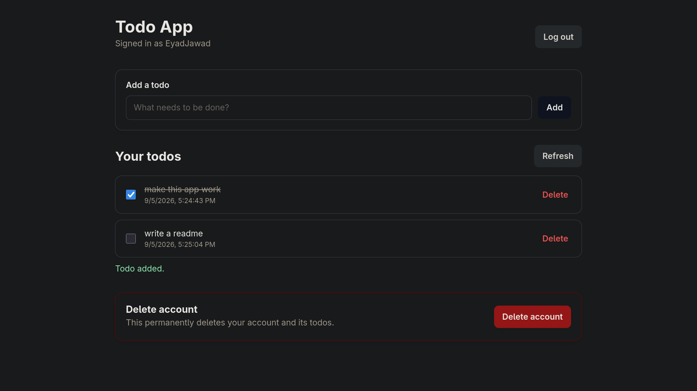

# Todo App

A Todo App where you can put all of your todos!  
[Live Demo!](https://eyad-jawad.github.io/todo-app/)



### Performance
This app relies on free services to run, and 4 of them at that, that't why it can be a "little" slow sometimes.

#### Rate Limits
Since everything is free, there's some kind of strict limits on the app:  

```

Authentication requests: 10req/5min  
Todo requests: 60req/60sec

```
## Design Choices
### Security
A hashing algoritm (`argon2`) is used to hash the passwords, as well as a salt (a default of the algoritm)  
As for the todos, they are stored in plain text, in the database. I have considered encrypting them, but the current, very free, infrastructure does not quite tolerate that much computation I think.

### Database
`SQLAlchemy` is used on top of `Postgresql` as a database for production, in testing sqlite is used, not a huge deal, but `Postgresql` might be more suitable for this project, `Neon` is the provider of that database.

### Rate Limits
`Redis` is used, from `Upstash`, I mainly chose it because it's memory based, and can be quicker for rate limit checks, that's why I thought it's more suitable, however, the current speeds are not the best, the main reason might be, as stated before, the services, but it's not that bad! A request to add a new todo would take `1s` at most, so don't worry much!

### Backend
`FastAPI` is used for backend, the provider is `FastAPICloud`, as the name suggests, it's fast, I mainly chose it because I know how to use it, there's no other reason.

### Frontend
A static website on `GitHub Pages`, not very important, I only made the bases, and the rest was done by AI for this one.

### Nginx? 
This required everything be at one place, which requires `$$$`, so I abandoned it, but if you want to use it run:

```

sudo docker compose up -d --build # to start it
sudo docker compose down -v # to shut it

```

But before you do that you should make a `.env` file where you need to store these variables:

```

POSTGRES_URL
POSTGRES_DB
POSTGRES_USER
POSTGRES_PASSWORD
POSTGRES_HOST

REDIS_URL
REDIS_HOST

```

You don't have to worry about anything else, but I suggest you run `just test` after you get it up to make sure everything is ok.

### Tests
Test coverage percent is not informative enough at this point, but it's `94%`, with one integration test if you set up the enviroment, `GitHub Actions` take care of that in the deployment of the app.

### Afterword
I have built once before, but abandoned it because it required too much frontend, but it did help me build this one, which took about `30h`? I don't know, but it was fun to make!  
Thanks for reading,  
`- Eyad`